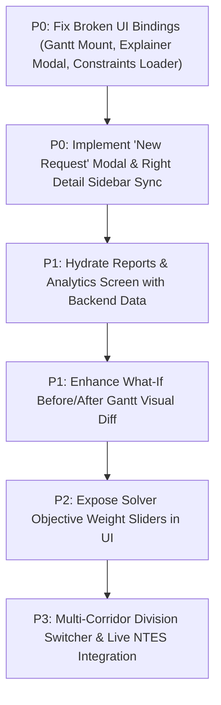

# RailOpt Legacy Project Comprehensive Audit Summary
**Repository:** `A:\SHREYAS\RAILWAY BLOCK AI`  
**Git Remote:** `https://github.com/shreyas30016/Railopt-SIH2026.git`  
**Problem Statement:** SIH 2026 SIH26027 — AI-Powered Automatic Block Planning System for Indian Railways  
**Audit Completion Date:** September 2026  
**Status:** Audit & Blueprint Complete — No Source Code Modified

---

## Executive Summary & Answers to the 14 Core Questions

### 1. What actually works?
- **Role & Division Authentication:** Sign-in screen (`/login`) validates user role and division code, stores session tokens in `localStorage`, and enforces role headers across screens.
- **Operations Dashboard:** Dynamic Bento KPIs, departmental demand breakdown chart, upcoming scheduled possessions table, live train movements status feed, and solver deconfliction cards.
- **Maintenance Backlog Management:** Tab filtering by department (Civil Eng, S&T, TRD, Mech), section dropdown, urgency filter, live text search, and in-table **Approve**, **Defer**, and **Delete** action buttons with real database updates and toast alerts.
- **OR-Tools Mathematical Optimization Engine:** Full Google OR-Tools CP-SAT solver generates optimal block plans deconflicted from train movements, calculates real maintenance hours, train delays, and shadow block synergies.
- **What-If Scenario Simulation:** Simulates train delays, section unavailability, maintenance overruns, and emergency rail fracture insertions; executes differential solver runs and returns KPI deltas.
- **CSV Data Export:** Operational reports page generates and downloads real CSV data containing historical solver run logs.
- **Live Train Movement Adapter:** Normalized train movements feed with realistic GPS delays and automatic fallback.

---

### 2. What is hardcoded?
- **Domain Configuration Constants:** Valid division codes (`NDL`, `NW`, `WR`, `CR`, `ER`, `SER`, `SCR`, `SR`, `NWR`, `NER`) and role definitions (`CONTROLLER`, `PLANNER`, `ENGINEER`, `TRD_OFFICER`, `ST_OFFICER`) in `auth.py`.
- **Engineering Safety Buffers:** Station spacing buffers and 25kV OHE isolation constraints in `railway_rules.yaml`.
- **Offline Client Fallbacks:** Fallback JSON objects in `dataService.js` (used only when backend connection fails).

---

### 3. What is fake / static?
- **Gantt Chart View Grid:** The HTML in `gantt-view.html` contains static hardcoded bars (`12302`, `J-01` to `J-06`, `B-01` to `B-05`) because the dynamic rendering script targets a missing element ID.
- **Maintenance Request Detail Sidebar:** The right sidebar in `maintenance-requests.html` contains static text for `Job J-03` (*"OHE Maintenance & Alignment"*) and does not yet update when different table rows are selected.
- **Constraints & Logic Narrative:** The text in `constraints-logic.html` is a static Stitch HTML template narrative (*"Optimization Reasoning: Job J-01 vs J-04"*).
- **Reports Charts & KPI Cards:** Top cards in `reports.html` show static numbers (`87.4%`, `92.1%`, `14m`, `12`), and the bar chart is composed of static HTML `div` bars.

---

### 4. What is genuinely connected?
- **`POST /api/auth/login`** $\rightarrow$ User Session & Header Personalization
- **`GET /api/dashboard/summary`** $\rightarrow$ Dashboard Bento KPIs, Donut Chart, Upcoming Blocks Table
- **`GET /api/trains/live`** $\rightarrow$ Dashboard Live Train Feed Cards
- **`GET /api/maintenance/requests`** $\rightarrow$ Maintenance Requests Filterable Table
- **`PUT /api/maintenance/requests/{id}`** $\rightarrow$ Request Approve / Defer Action
- **`DELETE /api/maintenance/requests/{id}`** $\rightarrow$ Request Permanent Delete Action
- **`POST /api/optimization/run`** $\rightarrow$ Google OR-Tools CP-SAT Solver Execution
- **`GET /api/optimization/latest`** $\rightarrow$ Block Planning Schedule & Before/After Comparison Table
- **`POST /api/whatif/simulate`** $\rightarrow$ What-If Disruption Scenario Execution
- **`GET /api/reports/analytics`** $\rightarrow$ Historical Optimization CSV Report Generation

---

### 5. What is broken?
1. **Gantt View Mounting Target (`gantt-view.html`):** `app.js` attempts to mount dynamic timeline rows to `#gantt-chart-container` or `.gantt-grid-body`, neither of which exists in `gantt-view.html`. This leaves the static mockup visible.
2. **"New Request" Modal Trigger (`maintenance-requests.html`):** The button calls `onclick="window.triggerNewRequestModal && window.triggerNewRequestModal()"`, but `window.triggerNewRequestModal` is not implemented in JavaScript.
3. **Decision Audit Explainer Modal (`optimizationResultView.js`):** Row buttons call `onclick="window.showJobExplanation && window.showJobExplanation(...)"`, but `window.showJobExplanation` is never assigned to `window` in `app.js`.
4. **Constraints Page Loader (`constraints-logic.html`):** `app.js:873` calls `dataService.getRailwayConstraints()`, which is missing from `dataService.js`, causing a `TypeError` in the browser console.
5. **Reports Dashboard Data Binding (`reports.html`):** `initReports()` only binds the CSV export button and does not hydrate the KPI cards or charts with the JSON from `/api/reports/analytics`.

---

### 6. What APIs exist?
- **Auth (3 endpoints):** `POST /api/auth/login`, `GET /api/auth/me`, `GET /api/auth/divisions`, `GET /api/auth/roles`
- **Dashboard (1 endpoint):** `GET /api/dashboard/summary`
- **Maintenance (6 endpoints):** `GET /api/maintenance/departments`, `GET /api/maintenance/sections`, `GET /api/maintenance/requests`, `POST /api/maintenance/requests`, `PUT /api/maintenance/requests/{id}`, `DELETE /api/maintenance/requests/{id}`, `POST /api/maintenance/predict-duration`
- **Optimization (5 endpoints):** `POST /api/optimization/run`, `POST /api/optimization`, `GET /api/optimization/latest`, `GET /api/optimization/run/{run_id}`, `GET /api/optimization/explanation/{job_code}`, `GET /api/optimization/rules`, `POST /optimize`
- **Gantt Timeline (1 endpoint):** `GET /api/gantt/timeline`
- **What-If Simulation (1 endpoint):** `POST /api/whatif/simulate`
- **Reports & Analytics (1 endpoint):** `GET /api/reports/analytics`
- **Train Movements (3 endpoints):** `GET /api/trains/live`, `GET /api/trains/status/{train_id}`, `POST /api/trains/simulate-delay`
- **Health Check (1 endpoint):** `GET /health`

---

### 7. What database / domain models exist?
All defined in `backend/app/models/models.py` (11 SQLAlchemy entities):
1. `Department` (ENG, S_T, TRD, MECH)
2. `Section` (NDLS-TKD, TKD-FDB, FDB-PWL, PWL-KDS, KDS-MTJ, MTJ-AGC)
3. `TrackLine` (UP_MAIN, DN_MAIN, 3RD_LINE)
4. `MaintenanceResource` (Tamping Machine, DTS, Tower Wagon, Gangs)
5. `MaintenanceJob` (Job code, urgency, duration, power block, traffic block, speed restriction, status)
6. `TrainSchedule` (Train number, priority weight, path, departure/arrival)
7. `BlockWindow` (Corridor maintenance lull windows)
8. `OptimizationRun` (Timestamp, status, objective score, solver runtime, KPIs)
9. `ScheduledBlock` (Assigned start/end minutes, paired shadow jobs, resource)
10. `ConflictLog` (Deconfliction records resolved by CP-SAT solver)
11. `DecisionExplanation` (Reasoning tree records)

---

### 8. What roles exist?
1. **Controller (DOM / TPC):** Full approval, optimization, and editing authority.
2. **Planner (Sr. DOM / DEN):** Full planning, optimization, and approval authority.
3. **Engineer (JE / SSE P-Way):** Civil Engineering request submission only.
4. **TRD Officer (JE / SSE OHE):** Traction Distribution power block request submission only.
5. **S&T Officer (JE / SSE Signal):** Signaling & Telecom request submission only.

---

### 9. What divisions exist?
10 Operational Divisions: `NDL` (Delhi), `NW`/`NCR` (Prayagraj), `WR` (Mumbai Central), `CR` (Mumbai CST), `ER` (Howrah), `SER` (Kharagpur), `SCR` (Secunderabad), `SR` (Chennai), `NWR` (Jaipur), `NER` (Gorakhpur).

---

### 10. What should we keep?
- **Keep the entire backend architecture:** FastAPI routers, OR-Tools CP-SAT solver (`solver.py`), SQLite/PostgreSQL models, and synthetic seeder.
- **Keep the Stitch visual design system:** Dark blue enterprise theme (`#001e40`, `#003366`), Inter + JetBrains Mono typography, Bento layouts, and Material Symbols.
- **Keep the client service abstraction:** `dataService.js`, `trainDataService.js`, and `appState.js`.
- **Keep all automated test suites:** All 8 test files in `tests/`.

---

### 11. What should we fix?
1. **Fix Gantt View Rendering:** Update DOM container selector in `gantt-view.html` / `app.js` so live solver bars mount correctly.
2. **Bind Explainer Modal:** Attach `window.showJobExplanation = (jobCode) => ...` in `app.js` to render the decision audit modal on click.
3. **Implement "New Request" Modal:** Build a modal for creating new maintenance jobs connected to `POST /api/maintenance/requests`.
4. **Fix Constraints Logic Page:** Add `getRailwayConstraints()` to `dataService.js` and dynamically render rules from `/api/optimization/rules`.
5. **Hydrate Reports Screen:** Bind `/api/reports/analytics` to KPI numbers and charts in `reports.html`.
6. **Sync Request Detail Sidebar:** Update the right-side detail panel in `maintenance-requests.html` when a row is clicked.

---

### 12. What should we rebuild?
- **None of the core architecture needs to be rewritten from scratch.** The core backend, solver, data models, and UI pages are already 75%+ implemented. Only targeted connection fixes and component bindings are required.

---

### 13. What should we NOT touch?
- **Do NOT alter solver mathematical formulation:** The OR-Tools CP-SAT constraints and shadow block pairing logic are mathematically sound and tested.
- **Do NOT change the UI theme / color palette:** Preserve the official `#003366` railway enterprise aesthetic.
- **Do NOT remove offline / mock fallback safety:** The fallback mechanism ensures 100% presentation uptime during judging.

---

### 14. What is the recommended implementation order?

---

## 2. Priority Action Table

| Priority Level | Item / Defect Description | Target File(s) | Impact on Demo / Judging |
| :--- | :--- | :--- | :--- |
| **P0 (Must Fix for Demo)** | Fix Gantt View DOM selector mismatch to display live CP-SAT schedule | `frontend/gantt-view.html`, `frontend/js/app.js` | Critical: Judges must see the dynamic 24h timeline. |
| **P0 (Must Fix for Demo)** | Connect Decision Audit Explainer modal to row click events | `frontend/js/app.js`, `frontend/js/components/optimizationResultView.js` | Critical: SIH core requirement (*"Explainable AI / Why this plan?"*). |
| **P0 (Must Fix for Demo)** | Implement "New Request" dialog connected to `POST /api/maintenance/requests` | `frontend/maintenance-requests.html`, `frontend/js/app.js` | High: Allows judges to add an urgent job and watch the optimizer reschedule. |
| **P0 (Must Fix for Demo)** | Fix `TypeError` on `/constraints-logic` by adding `getRailwayConstraints()` | `frontend/js/services/dataService.js`, `frontend/js/app.js` | High: Eliminates console error when clicking Domain Rules. |
| **P1 (Selection Differentiator)** | Dynamically update Maintenance Request right-hand detail sidebar on row click | `frontend/maintenance-requests.html`, `frontend/js/app.js` | Replaces static `J-03` placeholder with actual job details. |
| **P1 (Selection Differentiator)** | Hydrate Reports & Analytics KPI cards and charts from backend API | `frontend/reports.html`, `frontend/js/app.js` | Replaces static placeholder stats with live analytics. |
| **P1 (Selection Differentiator)** | Render concrete Before/After block tables in What-If scenario results | `frontend/what-if.html`, `frontend/js/app.js` | Visualizes exact rescheduling deltas during disruptions. |
| **P2 (Enhancement)** | Add solver objective weight sliders (Passenger delay vs Shadow synergy) | `frontend/block-planning.html`, `frontend/js/app.js` | Demonstrates human-in-the-loop solver customization. |
| **P3 (Future Integration)** | Live NTES / COA public train status adapter toggle | `backend/app/services/train_adapter.py` | Production railway integration readiness. |
